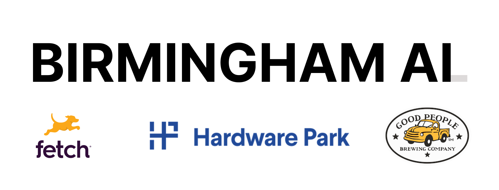

# TimescaleDB pgai & Hasura Data Delivery Network (DDN)

#### Have your LLMs in your database || your API 🎉

---

# Who are we?

Birmingham AI

- Big group (loads of backgrounds)
- Smaller group (engineer types)
- My name's Rob, I'm a senior engineer @ [Hasura](https://hasura.io/)
- Joined today by John Pruitt of [TimescaleDB](https://timescale.com)

---



---

# Follow us on GitHub for a chance to win free 🍻


---

# Today's agenda

1. 🍻 Have beers, network
2. ❓ How to utilize LLMs directly in your relational DB!
3. ❓ How to utilize LLMs directly in your auto-generated API!
4. 🍻 Have more beers, more networking

---

# Hasura Data Delivery Network (DDN)

- Auto-generated APIs
- Any source joined to any other source
- Custom business logic directly in your API
- Open-source (but, we'll host it for you if you like)
- Have teams?
  - Federation, flexibility, governance, confidence to ship... 🚀

---

# How's it work?

```sql
# We can go from SQL
CREATE TABLE developer (
    id bigint not null primary key generated by default as identity,
    name text NOT NULL,
    email text UNIQUE NOT NULL,
    created_at TIMESTAMPTZ NOT NULL DEFAULT NOW()
);
```

---

# How's it work?

```json
// To a JSON description
 "developer": {
  "schemaName": "public",
  "tableName": "developer",
  "columns": {
    "created_at": {
      "name": "created_at",
      "type": {
        "scalarType": "timestamptz"
      },
      "nullable": "nonNullable",
      "hasDefault": "hasDefault",
      "description": null
    },
    "email": {
      "name": "email",
      "type": {
        "scalarType": "text"
      },
      "nullable": "nonNullable",
      "description": null
    },
  ...},
... }
```

---

# How's it work?

```typescript
// Which we can then turn into a GraphQL type
type Developer {
  id: BigInt!
  name: String!
  email: String!
  createdAt: DateTime!
}
```

```graphql
# And then query it
query {
  developers {
    id
    name
    email
    createdAt
  }
}
```

---

# Why not do the same thing with statically-typed languages?

```typescript
// Thanks to types, we know the argument's name,
// its type, and what type the function should return
function greet(name: string): string {
  return `Hello, ${name}!`;
}
```

---

# Why not do the same thing with statically-typed languages?

We can query:

```graphql
query {
  greet(name: "World")
}
```

Which will return:

```json
{
  "data": {
    "greet": "Hello, World!"
  }
}
```

---

# What's it got to do with LLMs?

```typescript
export async function writeReleaseNotes(repoName: string) {
  const commits = await fetchCommitsByRepo(repoName);

  const prompt = `Below is a list of git commits...[truncated]
${JSON.stringify(commits)}`;

  const llmResponse = await ollama.chat({
    model: "llama3.1",
    messages: [
      {
        role: "system",
        content:
          "You are an expert software release engineer who specializes in authoring release notes.",
      },
      {
        role: "user",
        content: prompt,
      },
    ],
    stream: false,
  });

  return llmResponse.message.content;
}
```

---

# Why is this amazing?

```yaml
kind: Relationship
version: v1
definition:
  name: write_release_notes
  sourceType: Repository
  target:
    command:
      name: WriteReleaseNotes
  mapping:
    - source:
        fieldPath:
          - fieldName: name
      target:
        argument:
          argumentName: repoName
```

---

# Why is this amazing?

We can query a repo:

```graphql
query ReleaseNotesWithOverview {
  app_repositoryByName(name: "Kwik-E-Mart") {
    description
    write_release_notes
    commits {
      hash
      message
      developer {
        name
      }
    }
  }
}
```

---

# Why is this amazing?

Which will return:

```json
{
  "data": {
    "app_repositoryByName": {
      "description": "Kwik-E-Mart inventory and POS system",
      "write_release_notes": "[LLM-Generated Response Truncated for Brevity]",
      "commits": [
        {
          "hash": "3c1a9c61f52d92404b04134cb468653c3e244160",
          "message": "Refactored codebase to follow best practices",
          "developer": {
            "name": "Homer Simpson"
          }
        },
        {
          "hash": "eab8feb0ff0b0f587a3ece6cef7dfaa1af2a7b35",
          "message": "Resolved compatibility issues with older browsers",
          "developer": {
            "name": "Homer Simpson"
          }
        },
      ...],
    }
  }
}
```

---

# We need YOU!


